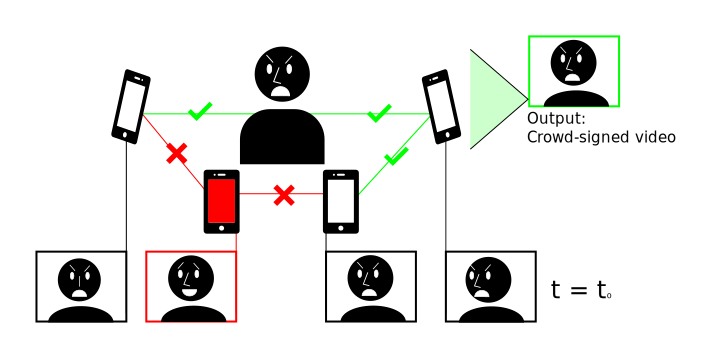

# Towards Untrusted Social Video Verification to Combat Deepfakes via Face Geometry Consistency

[Eleanor Tursman](https://tursmanor.github.io/),
Marilyn George,
[Seny Kamara](http://cs.brown.edu/~seny/),
[James Tompkin](http://jamestompkin.com/)  
Brown University  
Media Forensics CVPR Workshop 2020  



### [Paper](https://tursmanor.github.io/social-video-verification.pdf) | [Supplemental](https://tursmanor.github.io/social-video-verification-supp.pdf) | [Presentation Video](https://www.youtube.com/watch?v=b6gPMMjfRWA)

## Citation
If you find our work useful for your research, please cite:  

```
@InProceedings{Tursman_2020_CVPR_Workshops,
author = {Tursman, Eleanor and George, Marilyn and Kamara, Seny and Tompkin, James},
title = {Towards Untrusted Social Video Verification to Combat Deepfakes via Face Geometry Consistency},
booktitle = {The IEEE/CVF Conference on Computer Vision and Pattern Recognition (CVPR) Workshops},
month = {June},
year = {2020}
} 
```

The functions ```cpca```, ```screeplot```, ```mahalanobis```, ```kernelEVD```, ```greatsort```, and ```classSVD``` are from the [LIBRA toolbox](https://github.com/mwgeurts/libra), as described in the following papers:  
```
@article{verboven2005libra,
  title={LIBRA: a MATLAB library for robust analysis},
  author={Verboven, Sabine and Hubert, Mia},
  journal={Chemometrics and intelligent laboratory systems},
  volume={75},
  number={2},
  pages={127--136},
  year={2005},
  publisher={Elsevier}
}
``` 
```
@article{verboven2010matlab,
  title={Matlab library LIBRA},
  author={Verboven, Sabine and Hubert, Mia},
  journal={Wiley Interdisciplinary Reviews: Computational Statistics},
  volume={2},
  number={4},
  pages={509--515},
  year={2010},
  publisher={Wiley Online Library}
}
```
Code and data coming soon!

